<h1>Проект автоматизации тестирования <a target="_blank" href="https://habitica.com/"> Habitica.com </a> </h1>

<p align="center">

</p>

## Содержание
+ [Описание](#Описание)
+ [Технологии и инструменты](#Технологии-и-инструменты)
+ [Реализованные проверки](#Реализованные-проверки)
+ [Запуск тестов](#Запуск-тестов)
    + [Допустимые комбинации](#Допустимые-комбинации)
    + [Локальный запуск тестов](#Локальный-запуск-тестов)
    + [Удаленный запуск тестов](#Удаленный-запуск-тестов)
+ [Cборка тестов в Jenkins](#Cборка-тестов-в-Jenkins)
+ [Интеграция с Allure Report](#интеграция-с-allure-report)
    + [Диаграммы прохождения тестов](#Диаграммы-прохождения-тестов)
    + [Развернутый результат прохождения тестов](#Развернутый-результат-прохождения-тестов)
+ [Интеграция с Allure TestOps](#Интеграция-с-Allure-TestOps)
+ [Интеграция с Jira](#Интеграция-с-Jira)
+ [Уведомления в Telegram с использованием бота](#Уведомления-в-Telegram-с-использованием-бота)
+ [Пример выполнения теста в Selenoid](#Пример-выполнения-теста-в-Selenoid)
  

## Описание
Habitica — трекер задач, который совместил философию RPG и GTD(доведение дел до завершения) в своей веб-версии и приложениях для Android и iOS.
Проект состоит из UI-тестов, API и мобильных тестов на Android. <br/>

**Особенности проекта**:
- `Page Object` шаблон проектирования
- Использование техноголии `Owner` для придания тестам гибкости и легкости конфигурации
- Возможность запуска тестов: локально, удалённо, по тегам
- Использование `Faker` для генерации данных
- Использование `Lombok` для моделей в API тестах
- Использование собственных расширений:
    - `@WithLogin` для предварительной авторизации
    - `@LoggingExtension` для дополнительного логирования тестов
- Возможность запуска тестов напрямую из Allure TestOps
- Интеграция с Jira
- Уведомление о результатах прохождения в Telegram
- По итогу прохождения автотестов генерируется Allure отчет. Содержание отчета:
    - Шаги теста
    - Скриншот страницы на последнем шаге
    - Исходный код страницы в браузере
    - Логи консоли браузера
    - Видео выполнения автотеста

## Технологии и инструменты

<div align="center">
<a href="https://www.jetbrains.com/idea/"></a>
<a href="https://github.com/"></a>  
<a href="https://www.java.com/"></a>
<a href="https://gradle.org/"></a>  
<a href="https://junit.org/junit5/"></a>
<a href="https://selenide.org/"></a>
<a href="https://aerokube.com/selenoid/"></a>
<a href="https://rest-assured.io/"></a>
<a href="https://www.browserstack.com/"></a>
<a href="https://appium.io/"></a>
<a href="https://developer.android.com/studio"></a>
<a href="https://www.jenkins.io/"></a>
<a href="https://github.com/allure-framework/"></a>
<a href="https://qameta.io/"></a>
<a href="https://www.atlassian.com/software/jira"></a>  
<a href="https://telegram.org/"></a>
</div>

## Реализованные проверки
### Web
- [x] Проверка заголовка домашней страницы
- [x] Рендеринг на странице особого элемента, выбранного в фильтре
- [x] Рендеринг на странице особого элемента при поиске его в строке поиска
- [x] Проверка текста всплывающей подсказки на кнопке идентификатора пользователя
- [x] Проверка заголовков страниц, открываемых при нажатии на ссылки выпадающего меню "Инвентарь" (@ParameterizedTest)
- [x] Быстрое добавление привычки в список
- [x] Переадресация на страницу регистрации при нажатии кнопки "Get Started" домашней страницы
- [x] Неудачная регистрация без заполнения всех полей

### Api
- [x] Выполнение успешного запроса на авторизацию
- [x] Выполнение неудачного запроса на вход с пустым паролем
- [x] Выполнение неудачного запроса на вход с пустым телом
- [x] Запрос текущего списка тегов
- [x] Выполнение запроса на удаление тега

### Mobile
- [x] Неудачная попытка регистрации с недействительным адресом электронной почты.
- [x] Неудачная попытка регистрации без заполнения всех полей
- [x] Неудачная попытка регистрации со слишком коротким паролем

### Ручные проверки:
- [x] Быстрое добавление ежедневного дела в список
- [x] Быстрое добавление награды в список

## Запуск тестов
> [!NOTE]
> Убедитесь, что у вас установлены Java, Gradle, IntelliJ IDEA и в качестве браузера используется Chrome
>

Конфигурационные файлы `.properties` лежат в папке `resources`. <br/>
При необходимости можно изменить их.

### Допустимые комбинации

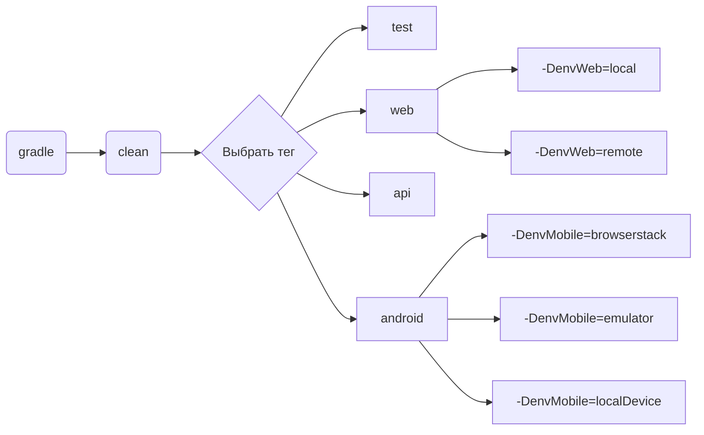

### Локальный запуск тестов
#### Запуск всех тестов

Для запуска следует открыть IntelliJ IDEA и выполнить в терминале:
```
gradle clean test
```

или 

```
gradle clean test -Denv=local
```

#### WEB

```
gradle clean web
```


#### API
```
gradle clean api 
```

#### Mobile

```
gradle clean android -DenvMobile=${ENV_MOBILE}
```
Для запуска мобильных тестов нужно определить значение envMobile:
- [ ] <code>-DenvMobile=browserstack</code> : тесты будут запущены в облачной платформе <a target="_blank" href="https://www.browserstack.com/"> Browserstack </a> 
- [ ] <code>-DenvMobile=emulator</code> : тесты будут запущены в эмуляторе, созданном средствами Appium Server & Appium Inspector. <br/> <a target="_blank" href="https://autotest.how/appium-setup-for-local-android-tutorial"> Инструкция по настройке </a> 
- [ ] <code>-DenvMobile=localDevice</code> : тесты будут запущены на устройстве, подключенному по usb. <br/> Так же требуется настройка Appium Server & Appium Inspector

<details>
   <summary>Дополнительные команды:</summary>
  
1. Выполнить запрос на формирование отчета:
```
gradle allureReport
```
2. Открыть отчет в браузере:
```
gradle allureServe
```

</details>

### Удаленный запуск тестов
Тесты можно запустить из терминала IntelliJ IDEA, а выполнены они будут в удаленно запущенном браузере в Docker-контейнере Selenoid:

```
gradle clean test -Denv=remote
```

Параметры, которыми можно управлять:
```
-DbrowserName - наименование браузера. По умолчанию chrome
-DbrowserVersion - номер версии браузера. По умолчанию 100.0
-DbrowserSize - размер окна браузера. По умолчанию 1980x1080
-DremoteUrl - адрес удаленного сервера, на котором будут запускаться тесты
```

## Cборка тестов в <b><a target="_blank" href="https://jenkins.autotests.cloud/job/C22-VadimSolonin-habitica-project/">Jenkins</a></b>

>Для запуска сборки необходимо перейти в раздел `Build with Parameters` и нажать кнопку `Build`

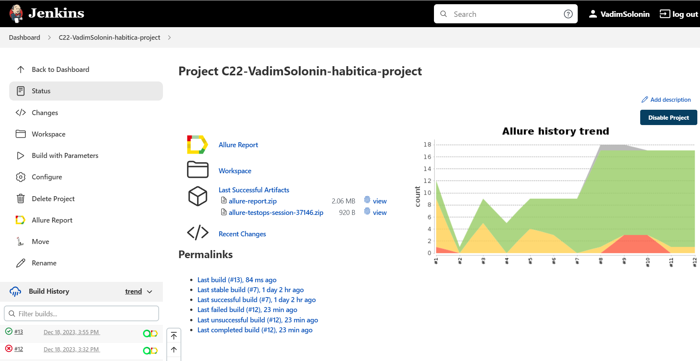

> Сборка с параметрами позволяет перед запуском задать нужные параметры для сборки:

<p align="center">
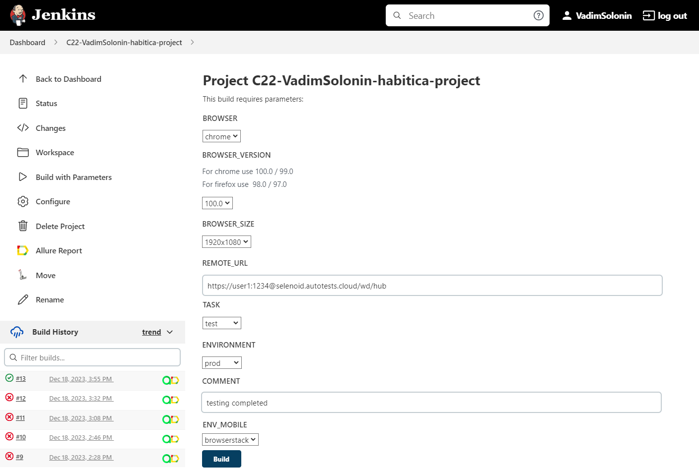
</p>

## Интеграция с <b><a target="_blank" href="https://jenkins.autotests.cloud/job/C22-VadimSolonin-habitica-project/13/allure/">Allure report</a></b>
#### Диаграммы прохождения тестов
`ALLURE REPORT` - отображает дату и время теста, общее количество запущенных тестов, а также диаграмму с процентом и количеством успешных, упавших и сломавшихся в процессе выполнения тестов <br/>
`TREND` - отображает тенденцию выполнения тестов для всех запусков <br/>
`SUITES` - отображает распределение тестов по сьютам <br/>
`CATEGORIES` - отображает распределение неудачных тестов по типам дефектов

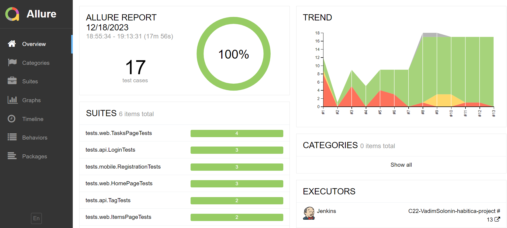

#### Развернутый результат прохождения тестов:
1. Общий список автотестов
2. Содержание автотеста
3. Вложения
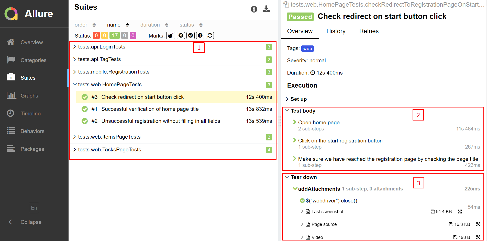


## Интеграция с <b><a target="_blank" href="https://allure.autotests.cloud/project/3876/dashboards">Allure TestOps</a></b>

>Диаграммы прохождения тестов
>
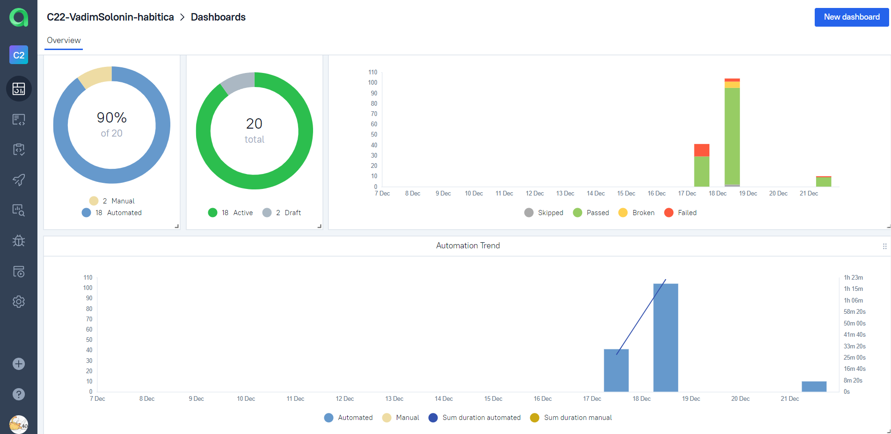

## Интеграция с <b><a target="_blank" href="https://jira.autotests.cloud/browse/HOMEWORK-1005">Jira</a></b>

>В Jira создана задача
>
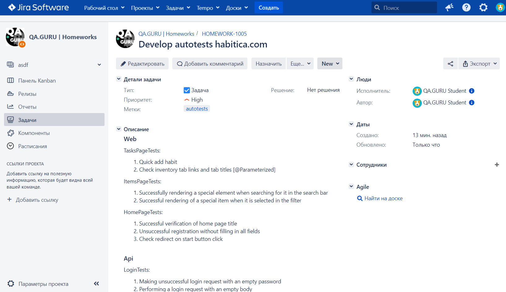

>В разделе `Allure:Test Cases` отображаются интегрированные автоматизированные и ручные тесты
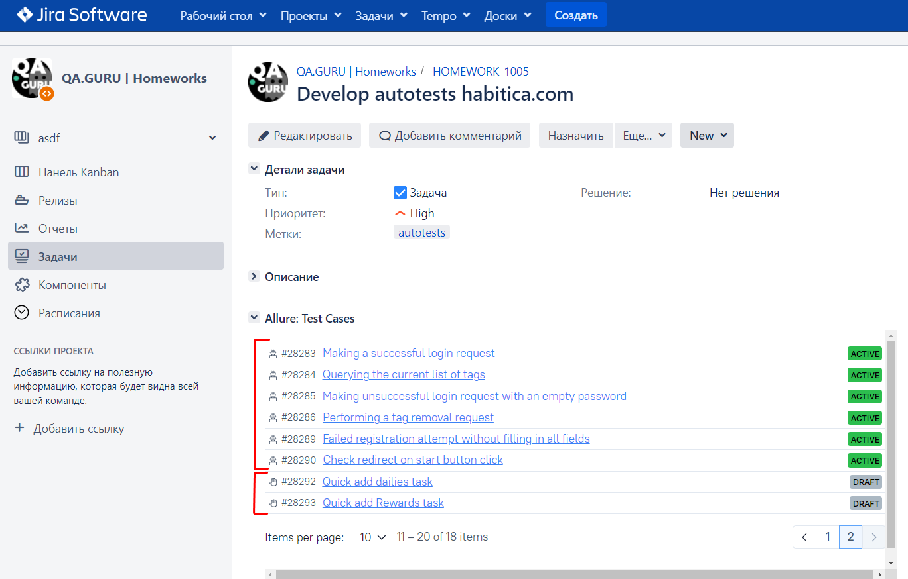

## Уведомления в Telegram с использованием бота

> Бот, созданный в Telegram, после завершения сборки отправляет сообщение с отчетом о прохождении тестов
> 
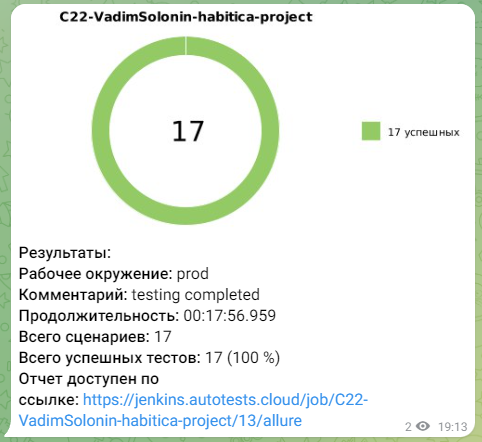

## Пример выполнения теста в Selenoid

> К каждому UI-тесту в отчете прилагается видео
<p align="center">
  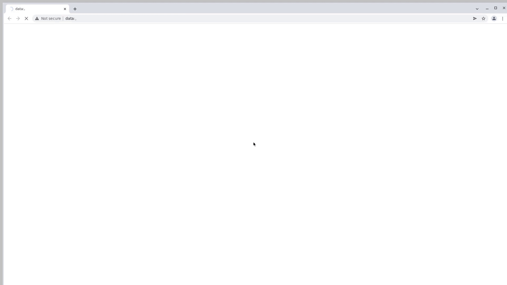
</p>

> К каждому мобильному тесту, выполняемому в Browserstack, к отчету прилагается видео
<p align="center">
  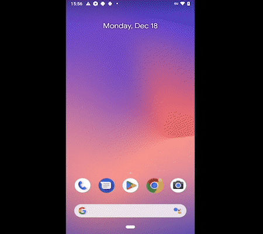
</p>
