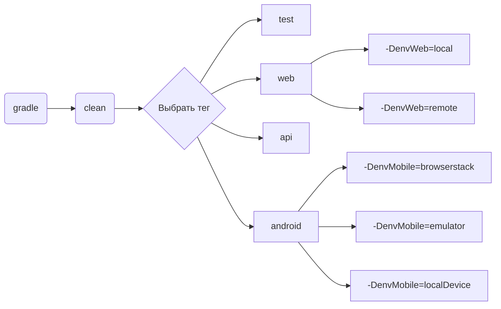

<h1>Проект автоматизации тестирования Habitica.com</h1>

<p align="center">

</p>

## Содержание
+ [Описание](#Описание)
+ [Стек технологий](#Стек-технологий)
+ [Тестовые сценарии](#Реализованные-проверки)
+ [Запуск тестов](#Запуск-тестов)
    + [Допустимые комбинации](#Допустимые-комбинации)
    + [Локальный запуск тестов](#Локальный-запуск-тестов)
    + [Удаленный запуск тестов](#Удаленный-запуск-тестов)
+ [Cборка тестов в Jenkins](#Cборка-тестов-в-Jenkins)
+ [Интеграция с Allure Report](#интеграция-с-allure-report)
    + [Диаграммы прохождения тестов](#Диаграммы-прохождения-тестов)
    + [Развернутый результат прохождения тестов](#Развернутый-результат-прохождения-тестов)
+ [Интеграция с Allure TestOps](#Интеграция-с-Allure-TestOps)
+ [Интеграция с Jira](#Интеграция-с-Jira)
+ [Уведомления в Telegram с использованием бота](#Уведомления-в-Telegram-с-использованием-бота)

## Описание
Habitica — трекер задач, который совместил философию RPG и GTD(доведение дел до завершения) в своей веб-версии и приложениях для Android и iOS.
Проект состоит из UI-тестов, API и мобильных тестов на Android.
Особенности проекта:
- Page Object шаблон проектирования
- Использование техноголии Owner для придания тестам гибкости и легкости конфигурации
- Возможность запуска тестов: локально, удалённо, по тегам
- Использование Faker для генерации данных
- Использование Lombok для моделей в API тестах
- По итогу прохождения автотестов генерируется Allure отчет. Содержание отчета:
    - Шаги теста
    - Скриншот страницы на последнем шаге
    - Исходный код страницы в браузере
    - Логи консоли браузера
    - Видео выполнения автотеста
- Возможность запуска тестов напрямую из Allure TestOps
- Интеграция с Jira
- Уведомление о результатах прохождения в Telegram

## Стек технологий
| IDEA | Java | GitHub | JUnit5 | Gradle | Selenide | Selenoid | Allure | Jenkins | Allure TO| Jira |
| ------ | ------ | ------ | ------ | ------ | ------ | ------ | ------ | ------ | ------ | ------ |
| <a href="https://www.jetbrains.com/idea/"></a> | <a href="https://www.java.com/"></a> | <a href="https://github.com/"></a> | <a href="https://junit.org/junit5/"></a> | <a href="https://gradle.org/"></a> | <a href="https://selenide.org/"></a>| <a href="https://aerokube.com/selenoid/"></a> | <a href="https://github.com/allure-framework/allure2"></a> | <a href="https://www.jenkins.io/"></a> | <a href="https://docs.qameta.io/allure-testops/"></a> | <a href="https://www.atlassian.com/ru/software/jira"></a>

## Реализованные проверки
### Web
- [x] Проверка заголовка домашней страницы
- [x] Рендеринг на странице особого элемента, выбранного в фильтре
- [x] Рендеринг на странице особого элемента при поиске его в строке поиска
- [x] Проверка текста всплывающей подсказки на кнопке идентификатора пользователя
- [x] Проверка заголовков страниц, открываемых при нажатии на ссылки выпадающего меню "Инвентарь" (@ParameterizedTest)
- [x] Быстрое добавление привычки в список
- [x] Переадресация на страницу регистарции при нажатии кнопки "Get Started" домашней страницы
- [x] Неудачная регистрация без заполнения всех полей

### Api
- [x] Выполнение успешного запроса на авторизацию
- [x] Выполнение неудачного запроса на вход с пустым паролем
- [x] Выполнение неудачного запроса на вход с пустым телом
- [x] Запрос текущего списка тегов
- [x] Выполнение запроса на удаление тега

### Mobile
- [x] Неудачная попытка регистрации с недействительным адресом электронной почты.
- [x] Неудачная попытка регистрации без заполнения всех полей
- [x] Неудачная попытка регистрации со слишком коротким паролем

### Ручные проверки:
- [x] Быстрое добавление ежедневного дела в список
- [x] Быстрое добавление награды в список

## Запуск тестов:

### Допустимые комбинации



### Локальный запуск тестов

#### Запуск всех тестов

```
gradle clean test
```

#### WEB

```
gradle clean web
```


#### API
```
gradle clean api 
```

#### Mobile

```
gradle clean android -DenvMobile=${ENV_MOBILE}
```
Для запуска мобильных тестов нужно определить значение envMobile:
- [ ] <code>-DenvMobile=browserstack</code> : тесты будут запущены в облачной платформе <a target="_blank" href="https://www.browserstack.com/"> Browserstack </a> 
- [ ] <code>-DenvMobile=emulator</code> : тесты будут запущены в эмуляторе, созданном средствами Appium Server & Appium Inspector. <br/> <a target="_blank" href="https://autotest.how/appium-setup-for-local-android-tutorial"> Инструкция по настройке </a> 
- [ ] <code>-DenvMobile=localDevice</code> : тесты будут запущены на устройстве, подключенному по usb. <br/> Так же требуется настройка Appium Server & Appium Inspector

<details>
   <summary>Дополнительные команды:</summary>
  
1. Выполнить запрос на формирование отчета:
```
gradle allureReport
```
2. Открыть отчет в браузере:
```
gradle allureServe
```

</details>

### Удаленный запуск тестов

```
clean
${TASK}
-DbrowserName=${BROWSER}
-DbrowserVersion=${BROWSER_VERSION}
-DbrowserSize=${BROWSER_SIZE}
-DremoteUrl=${REMOTE_URL}
"-DenvMobile=${ENV_MOBILE}"
```
>  `${TASK}` - запускаемая группа тестов. `test` запустит все тесты . `web` `api` `android` запустит тесты, отмеченные соответствующим тегом 
> 
> `${BROWSER}` - наименование браузера. По умолчанию <code>chrome</code>
> 
> `${BROWSER_VERSION}` - номер версии браузера. По умолчанию <code>100.0</code>
> 
> `${BROWSER_SIZE}` - размер окна браузера. По умолчанию - <code>1980x1080</code>
>
> `${REMOTE_URL}` - адрес удаленного сервера, на котором будут запускаться тесты
>
> `${ENV_MOBILE}` - переменная определения среды для запуска мобильных тестов

## Cборка тестов в <b><a target="_blank" href="https://jenkins.autotests.cloud/job/C22-VadimSolonin-habitica-project/">Jenkins</a></b>


## Интеграция с <b><a target="_blank" href="https://jenkins.autotests.cloud/job/C22-VadimSolonin-habitica-project/13/allure/">Allure report</a></b>
#### Диаграммы прохождения тестов:


#### Развернутый результат прохождения тестов:
1. Общий список автотестов
2. Содержание автотеста
3. Вложения


## Интеграция с <b><a target="_blank" href="https://allure.autotests.cloud/project/3876/dashboards">Allure TestOps</a></b>
Диаграммы прохождения тестов:


## Интеграция с <b><a target="_blank" href="https://jira.autotests.cloud/browse/HOMEWORK-1005">Jira</a></b>


## Уведомления в Telegram с использованием бота


